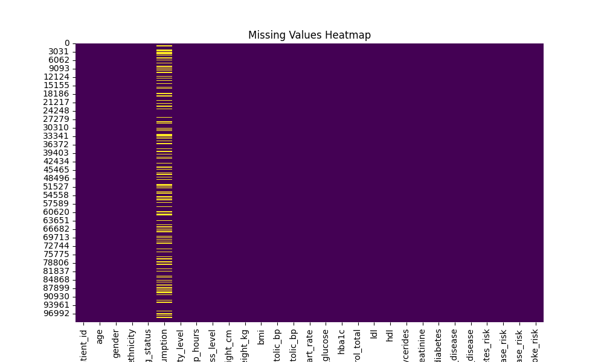
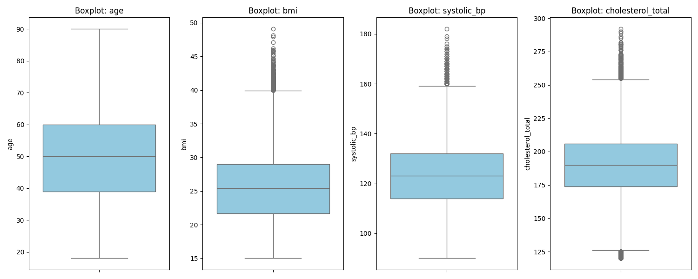
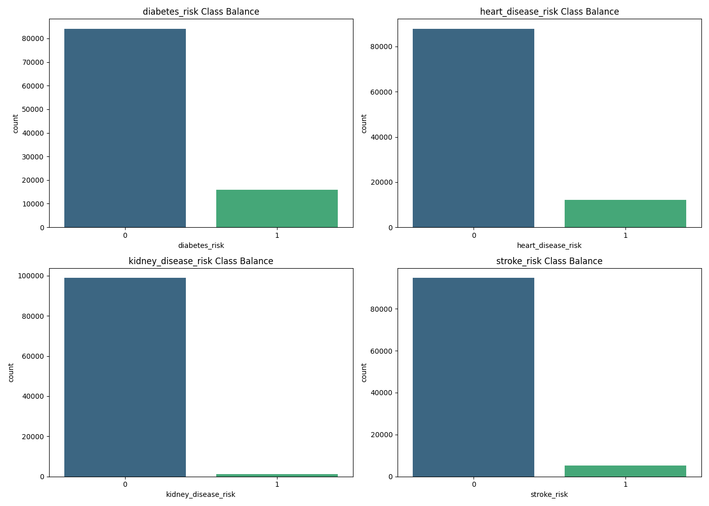
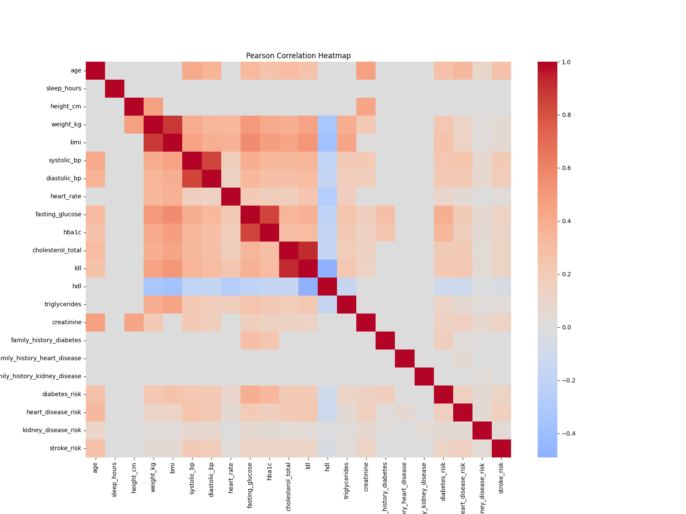

# Enterprise Data Quality Assessment Report

## Executive Summary
This report provides a comprehensive overview of the MedIntel AI synthetic dataset quality, covering completeness, uniqueness, consistency, and statistical validity.

## 1. Dataset Overview

- **Number of Rows**: 100000
- **Number of Columns**: 29
- **Memory Usage**: 61.13 MB
- **Data Types Summary**: {'int64': 15, 'object': 7, 'float64': 7}

## 2. Missing Value Analysis

|                     |   Missing_Count |   Missing_Pct |
|:--------------------|----------------:|--------------:|
| alcohol_consumption |           29933 |        29.933 |

## 3. Duplicate Analysis

- **Full-Row Duplicates**: 0 (0.00%)
- **Duplicate Patient IDs**: 0

**Recommended Handling Strategy**: 
- Exact full-row duplicates should be dropped immediately.
- Duplicate Patient IDs require further investigation to determine if they represent legitimate separate visits or data entry errors.

## 4. Data Type Validation

- **Numerical Columns**: 22
- **Categorical Columns**: 7

**Warning**: Mixed Datatypes detected in: ['alcohol_consumption']

## 5. Range Validation

### Out-of-Range Medical Anomalies
All medical metrics fall within plausible bounds.

## 6. Outlier Detection

### IQR Outlier Detection
- **sleep_hours**: 792 outliers (0.79%)
- **height_cm**: 82 outliers (0.08%)
- **weight_kg**: 720 outliers (0.72%)
- **bmi**: 296 outliers (0.30%)
- **systolic_bp**: 399 outliers (0.40%)
- **diastolic_bp**: 332 outliers (0.33%)
- **heart_rate**: 148 outliers (0.15%)
- **fasting_glucose**: 357 outliers (0.36%)
- **hba1c**: 176 outliers (0.18%)
- **cholesterol_total**: 655 outliers (0.66%)
- **ldl**: 354 outliers (0.35%)
- **hdl**: 751 outliers (0.75%)
- **triglycerides**: 498 outliers (0.50%)
- **creatinine**: 194 outliers (0.19%)

**Strategy Recommendation**: For healthcare datasets, statistical outliers are often valid pathological conditions (e.g., extremely high fasting glucose is indicative of severe diabetes, not a measurement error). Do not remove them blindly. Consider transformation or robust scaling instead of capping.

## 7. Class Balance Analysis

### Target Distributions
- **diabetes_risk**: Class 0 (84.1%), Class 1 (15.9%)
- **heart_disease_risk**: Class 0 (87.8%), Class 1 (12.2%)
- **kidney_disease_risk**: Class 0 (98.8%), Class 1 (1.2%)
- **stroke_risk**: Class 0 (94.7%), Class 1 (5.3%)

**Recommendation**: If the minority class is < 10%, consider applying SMOTE or class-weight adjustment during model training.

## 8. Correlation Analysis

### Highly Correlated Features (>0.80)
- bmi & weight_kg: 0.88
- diastolic_bp & systolic_bp: 0.85
- hba1c & fasting_glucose: 0.84
- ldl & cholesterol_total: 0.92

**Warning**: Multicollinearity detected. Consider removing one of the highly correlated features before training linear models.

## 9. Target Leakage Detection

### Potential Target Leakage
Checking for non-target features that have >0.8 correlation with a target variable.

No obvious target leakage detected through simple correlation.

## 10. Data Consistency Checks

### Logical Inconsistencies
All logical consistency checks passed.

## 11. Quality Score

### Overall Data Quality Score: **97.0 / 100**

- **Completeness**: 95.0/100
- **Accuracy**: 100.0/100
- **Consistency**: 100.0/100
- **Validity**: 90.0/100
- **Uniqueness**: 100.0/100

